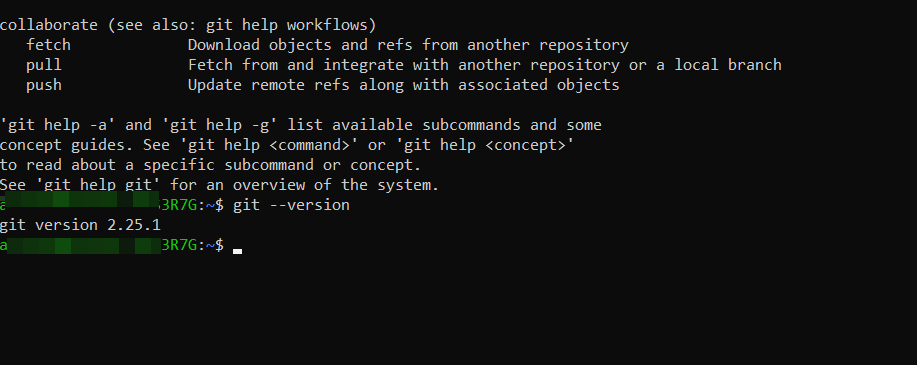

## Установка GIT в LInux Ubuntu (CLI apt)
Проверка наличия *GIT*:
```bosh=
$ git --version
```


Выполните в терминале команду:

```bosh=
$ sudo apt install git
```

[Вернуться к оглавлению](./readme.md)